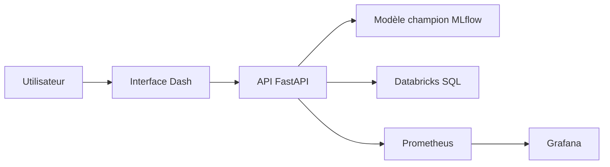

<div align="center">

# Fraud Scoring Platform

**Plateforme MLOps de détection de fraude bancaire — Scoring temps réel, supervision et gouvernance du modèle.**

[](https://www.python.org/)
[](https://fastapi.tiangolo.com/)
[](https://dash.plotly.com/)
[](https://mlflow.org/)
[](https://www.databricks.com/)
[](https://www.docker.com/)
[](#licence)

[Documentation](#api) · [Installation](#installation-locale) · [Docker](#lancement-avec-docker-compose) · [Sécurité](#sécurité-et-exploitation)

</div>

---

## Sommaire

1. [Vue d'ensemble](#vue-densemble)
2. [Fonctionnalités](#fonctionnalités)
3. [Stack technique](#stack-technique)
4. [Prérequis](#prérequis)
5. [Configuration](#configuration)
6. [Installation locale](#installation-locale)
7. [Lancement avec Docker Compose](#lancement-avec-docker-compose)
8. [API](#api)
9. [Tests et qualité](#tests-et-qualité)
10. [Structure du dépôt](#structure-du-dépôt)
11. [Sécurité et exploitation](#sécurité-et-exploitation)
12. [Licence](#licence)

---

## Vue d'ensemble

La **Fraud Scoring Platform** est une plateforme de détection de fraude bancaire composée de trois briques complémentaires :

- **Une API de scoring** (FastAPI) connectée au modèle champion MLflow hébergé sur Databricks/Unity Catalog.
- **Une interface opérationnelle** (Dash) permettant de scorer une transaction à la demande ou de consulter les scores batch.
- **Un dispositif de supervision** (Prometheus + Grafana) pour surveiller la santé du modèle et les performances de l'API.

Le projet charge dynamiquement le modèle identifié par l'alias MLflow `champion`, applique les transformations nécessaires (encodeur ordinal), et retourne pour chaque transaction un score, une décision et un niveau de risque.

### Architecture



### Parcours utilisateur

1. L'utilisateur se connecte à l'interface Dash (authentification locale, rôles).
2. Il saisit une transaction ou consulte un scoring batch.
3. L'API prépare les variables dérivées, applique l'encodeur et interroge le modèle identifié par l'alias MLflow `champion`.
4. Le résultat retourne un **score**, un **pourcentage**, une **décision** et un **niveau de risque**.

---

## Fonctionnalités

### Scoring et Machine Learning

- Scoring unitaire via API REST et interface web
- Scoring batch depuis Databricks SQL
- Consultation du modèle champion et de ses métriques MLflow
- Promotion d'une version au statut `champion` via l'API
- Encodeur ordinal sérialisé (`joblib`) versionné

### Sécurité et gouvernance

- Authentification, inscription et sessions
- Gestion des rôles (admin / analyst)
- Journalisation des actions utilisateurs
- Limitation de débit sur les endpoints sensibles
- Validation stricte des entrées via Pydantic

### Expérience utilisateur

- Interface bilingue (Français / Anglais)
- Thèmes clair et sombre
- Monitoring MLOps : métriques, versions, drift
- Export CSV et consultation des transactions notées

### Observabilité

- Métriques HTTP exposées à Prometheus
- Dashboards Grafana prêts à l'emploi
- Endpoint `/health` agrégé (API, modèle, encodeur, Databricks)
- Logs structurés

---

## Stack technique

| Domaine | Technologies |
| --- | --- |
| API | FastAPI, Pydantic, Uvicorn |
| Interface | Dash, Plotly |
| Machine Learning | scikit-learn 1.6.1, MLflow 3.8.1, joblib |
| Données et registre | Databricks SQL, Unity Catalog, MLflow Model Registry |
| Authentification | SQLite, sessions Dash, hash Werkzeug |
| Observabilité | Prometheus, Grafana, `prometheus-fastapi-instrumentator` |
| Qualité | pytest, pytest-cov, Ruff |
| Déploiement | Docker, Docker Compose |

---

## Prérequis

- **Python 3.11** ou **Docker Desktop**
- Un workspace **Databricks** accessible via SQL Warehouse
- Un modèle enregistré dans **Unity Catalog** sous le nom configuré, avec l'alias `champion`
- Le fichier `models/ml_ordinal_encoder.joblib` présent dans le dépôt (ou un chemin personnalisé via `ENCODER_PATH`)

---

## Configuration

La configuration est chargée depuis un fichier `.env` à la racine du projet.

> **Important** — Ne placez jamais de jeton Databricks réel dans le dépôt ou dans une image Docker.

```dotenv
# Databricks
DATABRICKS_HOST=https://<workspace>.cloud.databricks.com
DATABRICKS_TOKEN=<token>
DATABRICKS_HTTP_PATH=/sql/1.0/warehouses/<warehouse-id>

# Modèle et registre
CATALOG=pfa_data
SCHEMA=ml_outputs
MODEL_ALIAS=champion
ENCODER_PATH=./models/ml_ordinal_encoder.joblib

# Services
API_HOST=0.0.0.0
API_PORT=8000
API_URL=http://localhost:8000
DASH_PORT=8050
```

Le nom complet du modèle est construit automatiquement sous la forme :

```
<CATALOG>.<SCHEMA>.fraud_detection_model
```

Le fichier `.env` est consommé à la fois par l'API et par l'interface.

---

## Installation locale

### 1. Créer et activer l'environnement virtuel

```powershell
python -m venv .venv
.\.venv\Scripts\Activate.ps1
python -m pip install --upgrade pip
pip install -r requirements.txt
```

### 2. Lancer les services dans deux terminaux séparés

**Terminal 1 — API :**

```powershell
uvicorn api.main:app --reload --host 0.0.0.0 --port 8000
```

**Terminal 2 — Interface :**

```powershell
python -m ui.app
```

### 3. Accès

| Service | URL |
| --- | --- |
| Interface de détection | [http://localhost:8050](http://localhost:8050) |
| Documentation Swagger | [http://localhost:8000/docs](http://localhost:8000/docs) |
| Documentation ReDoc | [http://localhost:8000/redoc](http://localhost:8000/redoc) |
| Métriques Prometheus | [http://localhost:8000/metrics](http://localhost:8000/metrics) |

---

## Lancement avec Docker Compose

```powershell
docker compose up --build
```

### Services disponibles

| Service | Port | Rôle |
| --- | ---: | --- |
| `api` | `8000` | API de scoring et administration ML |
| `ui` | `8050` | Interface Dash |
| `prometheus` | `9090` | Collecte des métriques API |
| `grafana` | `3000` | Visualisation et supervision |

### Arrêt des conteneurs

```powershell
docker compose down
```

> Les données Prometheus et Grafana sont conservées dans les volumes Docker `prometheus_data` et `grafana_data`.

---

## API

### Endpoints

| Méthode | Route | Description |
| :---: | --- | --- |
| `GET` | `/health` | Vérifie l'API, le modèle, l'encodeur et Databricks |
| `POST` | `/predict` | Score une transaction |
| `GET` | `/batch` | Récupère les scores batch au-dessus d'un seuil |
| `GET` | `/model/info` | Consulte le modèle champion et ses métriques MLflow |
| `GET` | `/versions` | Liste les versions enregistrées |
| `POST` | `/promote/{version}` | Promeut une version en champion |

### Exemple de requête

```powershell
$body = @{
    montant           = 1250.50
    type_transaction  = "Paiement"
    mode_paiement     = "Carte"
    heure             = 23
    is_weekend        = 1
    est_international = 1
} | ConvertTo-Json

Invoke-RestMethod -Method Post `
    -Uri http://localhost:8000/predict `
    -ContentType "application/json" `
    -Body $body
```

### Seuils de décision

| Niveau de risque | Plage de score |
| --- | --- |
| Faible | `< 0.2` |
| Moyen | `0.2 – 0.5` |
| Élevé | `0.5 – 0.8` |
| Très élevé | `≥ 0.8` |

> Le seuil de décision fraude est fixé à **`0.5`**.

---

## Tests et qualité

```powershell
# Lancer les tests
pytest tests -v

# Avec rapport de couverture HTML
pytest tests -v --cov=api --cov=shared --cov-report=html

# Linter Ruff
ruff check .
```

Les tests couvrent notamment :

- L'API et ses endpoints
- Les services de scoring
- La base de données et l'authentification
- L'internationalisation (i18n)

---

## Structure du dépôt

```text
Fraude_Scoring/
├── api/                  # API FastAPI, schémas et services ML/Databricks
├── models/               # Encodeur sérialisé utilisé par le scoring
├── monitoring/           # Configuration Prometheus
├── shared/               # Configuration et logger partagés
├── tests/                # Tests automatisés
├── ui/                   # Application Dash, auth, pages et traductions
├── docker-compose.yml    # API, UI, Prometheus et Grafana
├── Dockerfile.api        # Image du backend
├── Dockerfile.ui         # Image de l'interface
└── requirements.txt      # Dépendances Python
```

---

## Sécurité et exploitation

Checklist avant mise en production :

- [ ] Utiliser exclusivement des variables d'environnement pour les secrets Databricks.
- [ ] Restreindre `allow_origins` dans `api/main.py` à l'origine de l'interface avant toute mise en production publique.
- [ ] Remplacer le mot de passe Grafana défini dans Compose.
- [ ] Protéger les routes d'administration (`/versions` et `/promote/{version}`) derrière une authentification et une autorisation adaptées.
- [ ] Surveiller `/health`, `/metrics` et les logs structurés lors des déploiements.
- [ ] Activer HTTPS/TLS en production (reverse proxy Nginx ou Traefik).

---

## Licence

**Proprietary** — À préciser selon les conditions de distribution du projet.

---

<div align="center">

**Fraud Scoring Platform** — Projet de Fin d'Année

Développé par **Japhet Allah-N'Diguim**

*Détection de fraude · Data · BI bancaire*

</div>